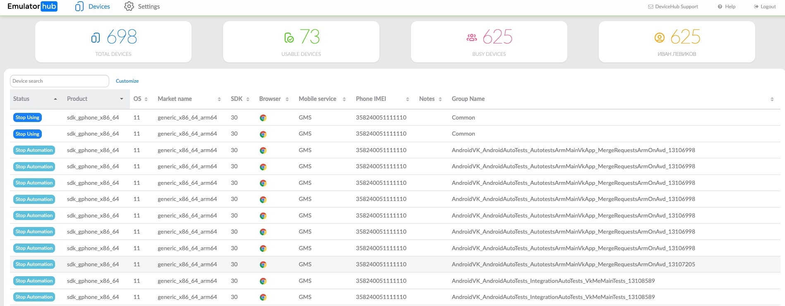

# Добро пожаловать в репозиторий VK DeviceHub!


## О проекте

VK DeviceHub - это форк проекта DeviceFarmer/stf, разработанный в компании VK.

Если у вас есть идеи, предложения или вы хотите принять участие в разработке, мы приглашаем вас присоединиться к нашему чату разработчиков ([ссылка](https://vk.me/join/QCCJfaPu544UDzXgQrXe1jNVMyVEdh9bFZg=)).

Презентацию о нашем продукте на конференции Heisenbug 2024 вы можете посмотреть по этой ссылке:
[Презентация на конференции Heisenbug 2024](https://heisenbug.ru/talks/cee3ec59796e43f6a3d4ae508db157d3/?referer=/schedule/days/)

Переведено с помощью DeepL.com (бесплатная версия)


## Как запустить?

1) Установите Docker
2) Запустите `docker compose -f docker-compose-prod.yaml --env-file scripts/variables.env up` и будет поднята локальная инсталляция на порту 8082. См [docker-compose-prod.yaml](./docker-compose-prod.yaml).

Осталось только добавить в ферму девайсы
Для этого нужно запустить провайдер и иметь работающее adb соединение с устройством.
Самый простой способ это:
1) Добавьте эту строчку: `127.0.0.1 devicehub-mongo` в ваш файл `/etc/hosts` (или `%systemroot%\system32\drivers\etc\hosts` если вы на Windows)
2) Убедиться что установлен питон и в нём установлен setuptools (нужен для одной из наших npm зависимостей)
3) Установить npm версии не меньше 20.17 (рекомендуем nvm)
4) `npm ci` - скачать и установить зависимости
5) `npm link --force` - Добавить исполняемый файл в текущий PATH
6) `MONGODB_PORT_27017_TCP=mongodb://localhost:27017 stf provider --connect-sub "tcp://localhost:7250" --connect-push "tcp://localhost:7270" --storage-url "http://localhost:8082"`

Замечание:
Некоторый функционал требует наличия прямого доступа до провайдера из браузера. Поэтому в случае сложных инсталляций не забудьте передать внешнедоступный url в параметр --public-url

Если вы хотите добавить iOS устройство, смотрите [этот документ (на английском)](doc/ios-docs/ios-device.md)

## Функционал

### База данных
- **Использование MongoDB**: Использует MongoDB вместо RethinkDB для повышения производительности и гибкости.

### Поддержка операционных систем
- **Android**:
  - Поддерживает широкий спектр версий от 2.3.3 (SDK уровня 10) до 14 (SDK уровня 34).
  - Совместимость с Wear 5.1 и Fire OS, CyanogenMod и другими дистрибутивами на базе Android.
  - **Не требуются Root права**: Все функции работают без необходимости получения root-доступа.
- **iOS**:
  - Все устройства и версии iOS которые поддерживаются в WebDriverAgent от Appium поддерживаются и в DeviceHub
  - Поддерживаются простые нажатия, жесты и физические кнопки на устройстве
  - Установка приложений на iOS
  - Поддержка расширенного дебага и взаимодействия планируется в 2025

### Удаленное управление и просмотр экрана
- **Дистанционное управление**: Беспрепятственное управление любым устройством из браузера.
- **Просмотр экрана в реальном времени**: Скорость обновления 30-40 кадров в секунду, в зависимости от технических характеристик устройства и версии Android.
- **Поддержка вращения**: Поддержка автоматической и ручной регулировки поворота для оптимального просмотра.
- **Ввод с клавиатуры**: Ввод текста непосредственно с клавиатуры с поддержкой мета-клавиш.
- **Копирование и вставка**: Включает поддержку операций копирования и вставки, хотя на старых устройствах может потребоваться ручная вставка.
- **Поддержка мультитач**: Обеспечивает взаимодействие с мультитач на сенсорных экранах и поддержку жестов на обычных экранах.
- **Установка с перетаскиванием**: Легкая установка и запуск файлов `.apk` с помощью функции drag-and-drop.
- **Обратная переадресация портов**: Доступ к локальному серверу непосредственно с устройства, даже через разные сети.
- **Веб-браузинг**: Открывайте веб-сайты в любом браузере с помощью функции определения установленных браузеров в режиме реального времени.

### Управление устройствами
- **Мониторинг инвентаря устройств**: Следите за подключенными устройствами, уровнем заряда батареи и характеристиками оборудования.
- **Поиск устройств**: Быстрый поиск устройств по различным признакам с помощью мощных поисковых запросов.
- **Идентификация пользователей**: Идентификация пользователей, подключенных к устройствам, и мониторинг использования устройств.
- **Поиск устройства**: Отображение идентификационной информации на экране для облегчения определения местоположения устройства.
- **Отслеживание заряда батареи**: Отслеживайте уровень заряда батареи и состояние каждого устройства.

### Системы бронирования и разделения
- **Система разделения**: Выделяйте устройства для различных проектов или организаций на неограниченный срок.
- **Система бронирования**: Резервирование устройств для пользователей на определенный период времени.
- **Управление группами**: Организуйте устройства, пользователей и расписания в группы для эффективного управления.
- **Подробная документация**: Инструкции по использованию функций резервирования и разделения см. в подробной документации.

**Управление групповыми запасами
- **Мониторинг состояния групп**: Отслеживайте состояние групп, включая активность, готовность и статус ожидания.
- **Поиск групп**: Поиск и фильтрация групп по различным атрибутам для удобства управления.
- **Связь с группами**: Связь с владельцами групп по электронной почте прямо из интерфейса.

### Управление устройствами и пользователями
- **Управление устройствами**: Поиск устройств, удаление устройств на основе фильтров, управление аннотациями и элементами управления устройствами.
- **Управление пользователями**: Создание, поиск и удаление пользователей, управление правами пользователей и установка групповых квот.
- **Общение с пользователями**: Связь с пользователями по электронной почте и создание пользователей служб через интерфейс командной строки (CLI).

### REST API
- **Простой REST API**: Программный доступ к функциям системы с помощью простого REST API. Подробности см. в документации по API.


## Краткое замечание о безопасности

Изначально STF был внутренним проектом без надежных мер безопасности и шифрования.
Однако мы устранили различные проблемы и общие уязвимости и уязвимости (CVE). Кроме того, мы обновили зависимости, в которых были обнаружены CVE.

Мы приветствуем вклад в дальнейшее повышение безопасности проекта.

## Building

Once you have installed all the requirements, you can proceed to fetch the remaining dependencies.

Start by fetching all NPM and Bower modules:

```bash
npm install
```

Additionally, you may want to link the module so that you can access the `stf` command directly from the command line:

```bash
npm link
```

With these steps completed, you should have a functional installation ready for local development.


## Running

STF consists of several independent processes that typically need to be launched separately. In our setup, each of these processes is its own unit. Refer to [DEPLOYMENT.md](doc/deployment/DEPLOYMENT.md) and [Setup Examples](https://github.com/devicefarmer/setup-examples) for more details.

However, for development purposes, there's a handy command to quickly launch all the required processes along with a mock login implementation. Please note that you **must** have MongoDB running beforehand.

```bash
docker run --rm -d -p 27017:27017 -h 127.0.0.1 --name mongo mongo:6.0.10 --replSet=test && sleep 4 && docker exec mongo mongosh --eval "rs.initiate();"
```

This command will start MongoDB locally.

In addition to native user accounts, STF provides an administrator level with increased rights on certain features (e.g., booking & partitioning systems, management of users & devices, etc.). The built-in administrator user has the following default credentials:
- Name: `administrator`
- Email: `administrator@fakedomain.com`

Another built-in object is the root standard group to which users and devices belong the first time they register with the STF database. Its default name is `Common`.

These built-in objects are created in the STF database if they do not already exist.

You can override the default values of these built-in objects by setting the following environment variables before initializing the STF database through the `stf local` or `stf migrate` commands:
- Root standard group name: `STF_ROOT_GROUP_NAME`
- Administrator user name: `STF_ADMIN_NAME`
- Administrator user email: `STF_ADMIN_EMAIL`

Once configured, you're ready to start up STF itself:

```bash
stf local
```

After the [webpack](http://webpack.github.io/) build process has finished (which may take a moment), your private STF instance should be accessible at [http://localhost:7100](http://localhost:7100). If you had devices connected before running the command, those devices should now be available for use. Otherwise, check your console for any errors. You can plug in or unplug devices at any time.

If you need to access STF from other machines, you can use the `--public-ip` option for quick testing:

```bash
stf local --public-ip <your_internal_network_ip_here>
```


## Updating

To update your development version, simply pull the repository and run `npm install` again.

## FAQ

### I already use STF with RethinkDB. How can I migrate to MongoDB?

You need to set up MongoDB and then run:

```bash
stf migrate-to-mongo
```

### Can I deploy STF to actual servers?

Yes, please refer to [DEPLOYMENT.md](doc/deployment/DEPLOYMENT.md) and [Setup Examples](https://github.com/devicefarmer/setup-examples) for deployment instructions.

### Will I have to change battery packs all the time?

Battery packs in devices that are in constant use typically last from 4 to 8 months. After this period, they begin to swell.
Expanded batteries should be replaced as soon as possible. Note that this issue isn't specific to STF; it's a common occurrence over time.
If you have come up with an interesting solution for running devices without batteries, please [let us know](https://vk.me/join/QCCJfaPu544UDzXgQrXe1jNVMyVEdh9bFZg=).

Ensure that your devices are set up to allow the display to turn off entirely after a short timeout, around 30 seconds or so. STF will wake it up when necessary. Otherwise, you risk reducing the lifetime of your device.

Note that you may encounter a problem if your USB hubs cannot both provide enough power for charging and support a data connection at the same time (data connections require power too). This can cause a device to stop charging when being used, resulting in many charging cycles. If this happens, you will need to [get a better USB hub](#recommended-hardware).

### Once I have the system running, can I pretty much leave it as is, or is manual intervention required?

In our experience, the system runs smoothly most of the time, with occasional issues mostly related to USB connections. Typically, you'll need to intervene about once a week.

The most common issue is when a device loses all its active USB connections momentarily. While errors may appear in the logs, the worker process will usually recover or get respawned automatically, requiring no action from your side.

However, there are some common errors that do require manual intervention:

* **One device worker keeps getting respawned all the time**
  - Rebooting the device usually resolves this issue. If the device stays online long enough, you might be able to reboot it from the UI. Otherwise, SSH into the server and manually run `adb reboot`.
  - This could indicate USB problems, and the device may need to be relocated. Simplifying your setup can reduce such issues. Refer to [troubleshooting](#troubleshooting).
  - We're working on implementing periodic automatic restarts and better graceful recovery to mitigate this issue.

* **A whole group of devices keeps dying at once**
  - These devices are likely connected to the same USB hub, which could be faulty, or there may be compatibility issues. This often occurs with USB 3.0 hubs or USB extension cards. See [recommended hardware](#recommended-hardware).

* **A device that should be online is not showing up in the list or is showing up as disconnected**
  - Refer to [troubleshooting](#troubleshooting) for assistance.

### How do I uninstall STF from my device?

When you unplug your device, all STF utilities except STFService stop running automatically. There's no harm in force stopping or uninstalling it.

To uninstall the STFService, run the following command:

```bash
adb uninstall jp.co.cyberagent.stf
```

You may also want to remove our support binaries, although they won't run unless the device is connected to STF. You can do this as follows:

```bash
adb shell rm /data/local/tmp/minicap \
  /data/local/tmp/minicap.so \
  /data/local/tmp/minitouch \
  /data/local/tmp/minirev
```

Your device is now clean.


### Scrcpy

If you want use scrcpy instead minicap run app with next command(Scrcpy functionality is in unstable state yet):

```bash
stf local --need-scrcpy true
```

## Testing

Refer to [TESTING.md](doc/TESTING.md) for testing instructions.

## Contributing

To contribute, please read the guidelines outlined in [CONTRIBUTING.md](CONTRIBUTING.md).

## License

For licensing information, please see [LICENSE](LICENSE).

Copyright © 2024 V Kontakte LLC. All Rights Reserved.
