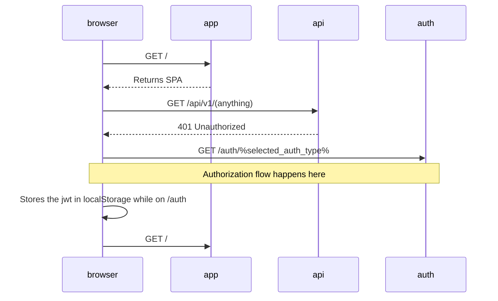

# Authorization flow

```mermaid
sequenceDiagram
browser ->> app: GET /
app -->> browser: Returns SPA
browser ->> api: GET /api/v1/(anything)
api -->> browser: 401 Unauthorized
browser ->> auth: GET /auth/%selected_auth_type%
Note over auth,browser: Authorization flow happens here
browser ->> browser: Stores the jwt in localStorage while on /auth
browser ->> app: GET /
```
