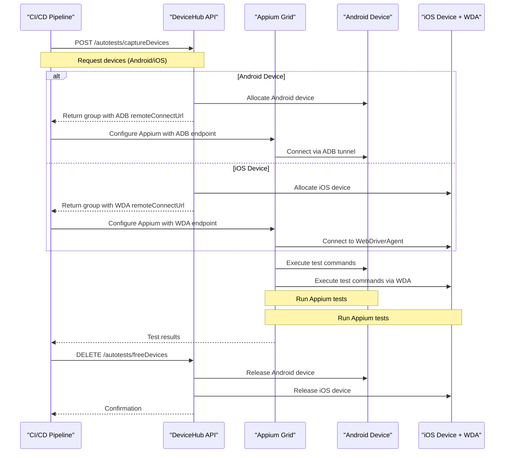

# Use DeviceHub for Appium Tests

DeviceHub provides a unified autotest API that works with both Android and iOS devices for Appium Grid integration. 
The key difference is that Android devices use ADB connections while iOS devices use WebDriverAgent (WDA) connections, both exposed through the `remoteConnectUrl` field.

### Unified Sequence Diagram



### API Endpoints and curl Examples

#### 1. Capture Devices

**Endpoint**: `GET /api/v1/autotests`

**Android devices:**
```bash
curl -H "Authorization: Bearer YOUR-TOKEN-HERE" \
  "https://devicehub.example.com/api/v1/autotests?amount=2&timeout=600&run=Android-Test-Run&need_amount=true&abi=armeabi-v7a&type=android"
```

**iOS devices:**
```bash
curl -H "Authorization: Bearer YOUR-TOKEN-HERE" \
  "https://devicehub.example.com/api/v1/autotests?amount=1&timeout=600&run=iOS-Test-Run&need_amount=true&type=ios"
```

**Parameters** :
- `amount`: Number of devices (required)
- `timeout`: Timeout in seconds (required, max 3 hours)
- `run`: Test run identifier (required)
- `need_amount`: Strictly enforce device count
- `abi`: CPU architecture (Android)
- `type`: Device type (android/ios)
- `model`, `sdk`, `version`: Additional filters

#### 2. Release Devices

**Endpoint**: `DELETE /api/v1/autotests`

```bash
curl -X DELETE -H "Authorization: Bearer YOUR-TOKEN-HERE" \
  "https://devicehub.example.com/api/v1/autotests?group=GROUP_ID_FROM_CAPTURE_RESPONSE"
```

### Python Code Examples

Example use [devicehub_client](../../test/api/devicehub_client) package for accessing the API.

#### Authentication Setup
```python
from devicehub_client import AuthenticatedClient

client = AuthenticatedClient(
    base_url="https://your-devicehub.com",
    token="your-access-token"
)
```

#### Device Capture (Both Platforms)
```python
from devicehub_client.api.autotests import capture_devices

# Android devices
android_response = capture_devices.sync_detailed(
    client=client,
    timeout=600,
    amount=2,
    need_amount=True,
    abi='armeabi-v7a',
    type='android',
    run='Android-Test-run-example'
)

# iOS devices  
ios_response = capture_devices.sync_detailed(
    client=client,
    timeout=600,
    amount=1,
    need_amount=True,
    type='ios',
    run='iOS-Test-run-example'
)
```

#### Extract Connection Information
```python
def extract_device_info(response):
    if response.parsed.success:
        group = response.parsed.group
        devices_info = []
        
        for device in group.devices:
            if device.ios:
                # iOS: WDA connection URL
                connection_info = {
                    'platform': 'iOS',
                    'udid': device.serial,
                    'wda_url': device.remoteConnectUrl,  # e.g., "http://192.168.1.100:8100"
                    'model': device.model
                }
            else:
                # Android: ADB connection URL
                connection_info = {
                    'platform': 'Android',
                    'serial': device.serial,
                    'adb_url': device.remoteConnectUrl,  # e.g., "192.168.1.100:5555"
                    'model': device.model
                }
            devices_info.append(connection_info)
        
        return devices_info, group.id
    return None, None
```

#### Appium Grid Configuration
```python
from appium import webdriver

def create_appium_driver(device_info, appium_hub_url):
    if device_info['platform'] == 'Android':
        # Android configuration
        adb_host, adb_port = device_info['adb_url'].split(':')
        desired_caps = {
            'platformName': 'Android',
            'deviceName': device_info['model'],
            'udid': device_info['serial'],
            'adbHost': adb_host,
            'adbPort': int(adb_port),
            'automationName': 'UiAutomator2'
        }
    else:
        # iOS configuration
        wda_port = device_info['wda_url'].split(':')[-1]
        desired_caps = {
            'platformName': 'iOS',
            'deviceName': device_info['model'],
            'udid': device_info['udid'],
            'wdaRemotePort': int(wda_port),
            'usePrebuiltWDA': True,
            'automationName': 'XCUITest'
        }
    
    return webdriver.Remote(appium_hub_url, desired_caps)
```

#### Device Release
```python
from devicehub_client.api.autotests import free_devices

def release_devices(client, group_id):
    response = free_devices.sync_detailed(
        client=client,
        group=group_id
    )
    return response.parsed.success if response.parsed else False
```

### Complete Integration Example

```python
def run_appium_tests_with_devicehub():
    # 1. Setup client
    client = AuthenticatedClient(
        base_url="https://your-devicehub.com",
        token="your-access-token"
    )
    
    # 2. Capture devices (mixed Android/iOS)
    android_response = capture_devices.sync_detailed(
        client=client, timeout=600, amount=1, 
        type='android', run='Mixed-Test-Run'
    )
    
    ios_response = capture_devices.sync_detailed(
        client=client, timeout=600, amount=1,
        type='ios', run='Mixed-Test-Run-iOS'
    )
    
    try:
        # 3. Extract device information
        android_devices, android_group_id = extract_device_info(android_response)
        ios_devices, ios_group_id = extract_device_info(ios_response)
        
        # 4. Create Appium drivers
        drivers = []
        for device in android_devices + ios_devices:
            driver = create_appium_driver(device, 'http://appium-grid:4444/wd/hub')
            drivers.append(driver)
        
        # 5. Run your tests
        for driver in drivers:
            # Your test logic here
            driver.find_element_by_id("some-element").click()
            
    finally:
        # 6. Cleanup
        for driver in drivers:
            driver.quit()
        
        if android_group_id:
            release_devices(client, android_group_id)
        if ios_group_id:
            release_devices(client, ios_group_id)
```

### Platform-Specific Implementation Details

**Android**: Uses ADB connections exposed through `remoteConnectUrl` 

**iOS**: Requires WebDriverAgent setup and uses `pymobiledevice3` for port forwarding. The iOS provider handles WDA connectivity automatically.

### Authentication

Generate access tokens from DeviceHub UI (Settings → Keys):

```bash
curl -H "Authorization: Bearer YOUR-TOKEN-HERE" \
  https://devicehub.example.com/api/v1/user
```

## Notes

The unified API works seamlessly for both platforms through the same endpoints, with DeviceHub automatically handling the underlying protocol differences (ADB vs WDA). Regular users are limited to 2 devices per test run. The system supports device filtering by architecture, model, SDK level, and platform type for precise device allocation.
