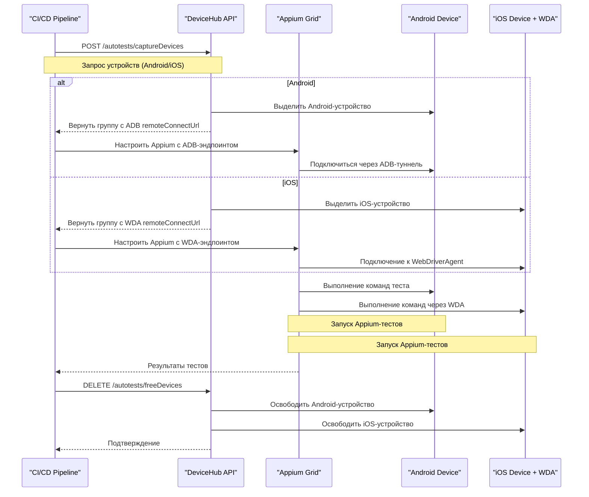

# Использование DeviceHub для Appium-тестов

DeviceHub предоставляет унифицированный API для автотестов, который работает как с Android, так и с iOS-устройствами для интеграции с Appium Grid.  
Ключевое различие: Android использует соединения ADB, а iOS — WebDriverAgent (WDA), оба через поле `remoteConnectUrl`.

### Унифицированная диаграмма последовательностей



### API эндпоинты и примеры curl

#### 1. Захват устройств

**Эндпоинт**: `GET /api/v1/autotests`

**Android:**
```bash
curl -H "Authorization: Bearer YOUR-TOKEN-HERE" \
  "https://devicehub.example.com/api/v1/autotests?amount=2&timeout=600&run=Android-Test-Run&need_amount=true&abi=armeabi-v7a&type=android"
```

**iOS:**
```bash
curl -H "Authorization: Bearer YOUR-TOKEN-HERE" \
  "https://devicehub.example.com/api/v1/autotests?amount=1&timeout=600&run=iOS-Test-Run&need_amount=true&type=ios"
```

**Параметры**:
- `amount`: Количество устройств (обязательно)
- `timeout`: Таймаут в секундах (макс. 3 часа)
- `run`: Идентификатор тест-рана (обязательно)
- `need_amount`: Строгая проверка количества
- `abi`: Архитектура CPU (Android)
- `type`: Тип устройства (android/ios)
- `model`, `sdk`, `version`: Дополнительные фильтры

#### 2. Освобождение устройств

**Эндпоинт**: `DELETE /api/v1/autotests`

```bash
curl -X DELETE -H "Authorization: Bearer YOUR-TOKEN-HERE" \
  "https://devicehub.example.com/api/v1/autotests?group=GROUP_ID_FROM_CAPTURE_RESPONSE"
```

### Примеры кода на Python

#### Аутентификация
```python
from devicehub_client import AuthenticatedClient

client = AuthenticatedClient(
    base_url="https://your-devicehub.com",
    token="your-access-token"
)
```

#### Захват устройств (Android и iOS)
```python
from devicehub_client.api.autotests import capture_devices

# Android
android_response = capture_devices.sync_detailed(
    client=client,
    timeout=600,
    amount=2,
    need_amount=True,
    abi='armeabi-v7a',
    type='android',
    run='Android-Test-run-example'
)

# iOS
ios_response = capture_devices.sync_detailed(
    client=client,
    timeout=600,
    amount=1,
    need_amount=True,
    type='ios',
    run='iOS-Test-run-example'
)
```

#### Извлечение информации об устройствах
```python
def extract_device_info(response):
    if response.parsed.success:
        group = response.parsed.group
        devices_info = []

        for device in group.devices:
            if device.ios:
                connection_info = {
                    'platform': 'iOS',
                    'udid': device.serial,
                    'wda_url': device.remoteConnectUrl,
                    'model': device.model
                }
            else:
                connection_info = {
                    'platform': 'Android',
                    'serial': device.serial,
                    'adb_url': device.remoteConnectUrl,
                    'model': device.model
                }
            devices_info.append(connection_info)

        return devices_info, group.id
    return None, None
```

#### Конфигурация Appium Grid
```python
from appium import webdriver

def create_appium_driver(device_info, appium_hub_url):
    if device_info['platform'] == 'Android':
        adb_host, adb_port = device_info['adb_url'].split(':')
        desired_caps = {
            'platformName': 'Android',
            'deviceName': device_info['model'],
            'udid': device_info['serial'],
            'adbHost': adb_host,
            'adbPort': int(adb_port),
            'automationName': 'UiAutomator2'
        }
    else:
        wda_port = device_info['wda_url'].split(':')[-1]
        desired_caps = {
            'platformName': 'iOS',
            'deviceName': device_info['model'],
            'udid': device_info['udid'],
            'wdaRemotePort': int(wda_port),
            'usePrebuiltWDA': True,
            'automationName': 'XCUITest'
        }

    return webdriver.Remote(appium_hub_url, desired_caps)
```

#### Освобождение устройств
```python
from devicehub_client.api.autotests import free_devices

def release_devices(client, group_id):
    response = free_devices.sync_detailed(
        client=client,
        group=group_id
    )
    return response.parsed.success if response.parsed else False
```

### Полный пример интеграции

```python
def run_appium_tests_with_devicehub():
    client = AuthenticatedClient(
        base_url="https://your-devicehub.com",
        token="your-access-token"
    )

    android_response = capture_devices.sync_detailed(
        client=client, timeout=600, amount=1, 
        type='android', run='Mixed-Test-Run'
    )

    ios_response = capture_devices.sync_detailed(
        client=client, timeout=600, amount=1,
        type='ios', run='Mixed-Test-Run-iOS'
    )

    try:
        android_devices, android_group_id = extract_device_info(android_response)
        ios_devices, ios_group_id = extract_device_info(ios_response)

        drivers = []
        for device in android_devices + ios_devices:
            driver = create_appium_driver(device, 'http://appium-grid:4444/wd/hub')
            drivers.append(driver)

        for driver in drivers:
            driver.find_element_by_id("some-element").click()

    finally:
        for driver in drivers:
            driver.quit()

        if android_group_id:
            release_devices(client, android_group_id)
        if ios_group_id:
            release_devices(client, ios_group_id)
```

### Особенности реализации

**Android**: использует соединения ADB через `remoteConnectUrl`  
**iOS**: использует WebDriverAgent и требует `pymobiledevice3` для проброса портов. Провайдер iOS автоматически управляет подключением к WDA.

### Аутентификация

Токены доступа создаются в интерфейсе DeviceHub (Настройки → Ключи):

```bash
curl -H "Authorization: Bearer YOUR-TOKEN-HERE" \
  https://devicehub.example.com/api/v1/user
```

## Примечания

Унифицированный API работает для обеих платформ через одни и те же эндпоинты — DeviceHub автоматически управляет различиями между ADB и WDA. Пользователи могут одновременно использовать до 2 устройств на запуск.  
Система поддерживает фильтрацию по архитектуре, модели, версии SDK и типу платформы.
