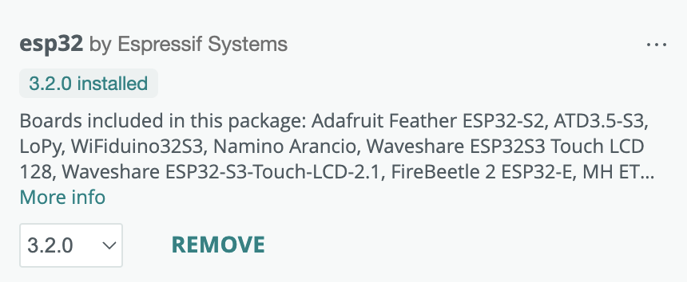
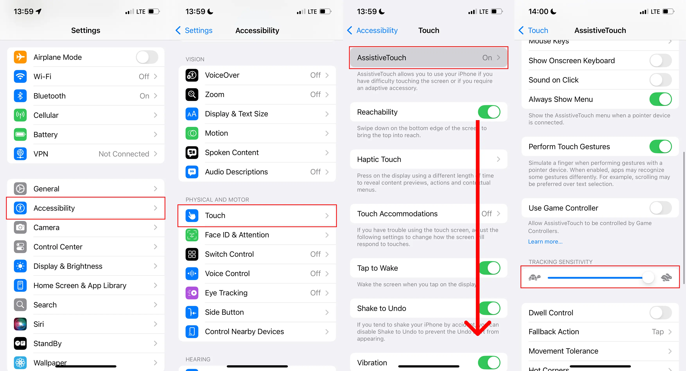
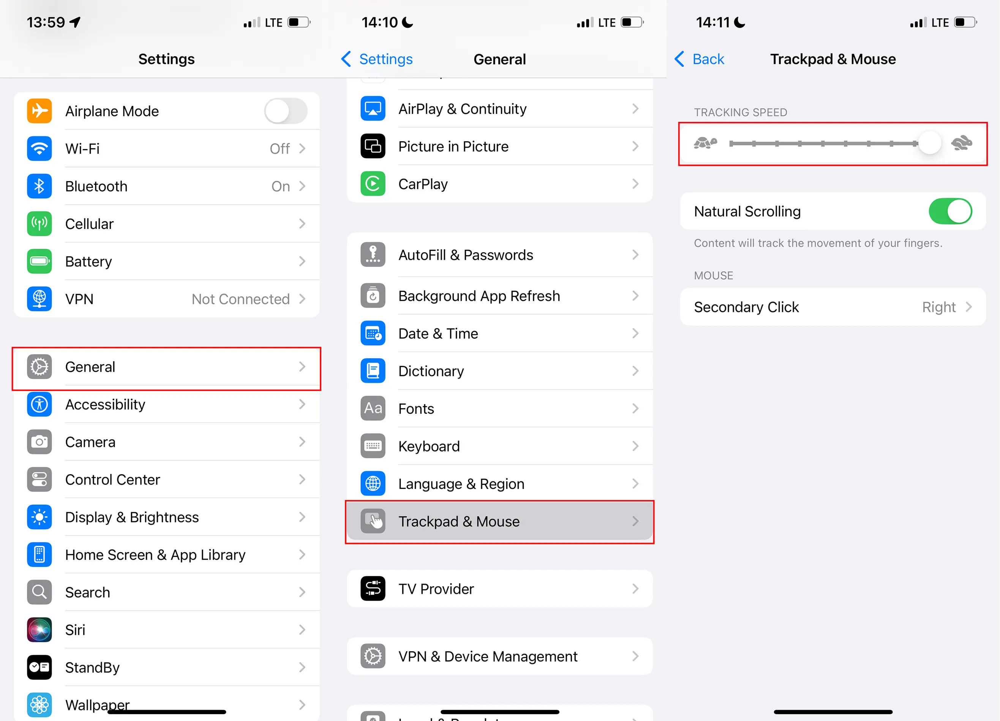

## Поддержка контроллера мыши на ESP32

### Мотивация

WebDriverAgent, который мы сейчас используем для захвата экрана, даёт нам возможность выполнять простые касания и жесты через REST-endpoint. Это неидеально с точки зрения удобства, потому что жест пользователя отправляется только после его завершения, что в итоге вызывает задержки и неудобства.

### Краткое описание

Начиная с iOS 13, система поддерживает указательное устройство — мышь и клавиатуру для Assistive Touch.  
DeviceHub использует эту функциональность, чтобы эмулировать работу настоящей мышки для iPhone, используя чип ESP32 с возможностями Bluetooth, тем самым позволяя совершать продвинутые жесты в режиме реального времени прямо из браузера.

Поскольку мышь — это устройство относительного позиционирования, а в браузере мы получаем абсолютные координаты курсора на экране, нам нужно преобразовывать абсолютную цель для курсора в события мыши с относительными дельтами.  
Мы достигаем этого, устанавливая максимально возможную чувствительность в настройках iOS и отслеживая текущее (предполагаемое) положение курсора iOS.

### Необходимое оборудование

Лучше всего в наших экспериментах показал себя чип ESP32-C6. Но, в принципе, любой ESP32 с встроенным Bluetooth-чипом подойдёт.  
Мы также протестировали ESP32-C3 и ESP32-WROOM-32; оба показали отличные результаты, причём C3 почти ничем не уступает C6.  
Важно, чтобы на плате был USB-порт для подключения к компьютеру, а также последовательный интерфейс, по которому будут отправляться пакеты. Также убедитесь, что на плате действительно есть **нативная** поддержка BLE.

### Как это сделать

#### 1. Прошивка (Flashing) прошивки

1. Скачайте и установите Arduino IDE.  
2. Добавьте этот URL в поле "Additional boards manager URLs" в настройках: `https://espressif.github.io/arduino-esp32/package_esp32_index.json` и установите плату ESP32 в разделе "Boards manager".  
   
3. Откройте [скетч из репозитория](../../lib/units/ios-device/plugins/touch/ESP32Mouse/).  
4. Подключите вашу плату и выберите её в меню "Tools":  
   - Сначала выберите порт вашей платы
   - Затем выберите её название. Если в списке его нет — выберите “ESP32 Dev Module” (это универсальный вариант для большинства плат)
5. Убедитесь, что опция USB CDC On Boot включена (“Enabled”), если она доступна для вашей платы.
6. Нажмите "Upload".

После успешной прошивки вы должны увидеть в Serial Monitor сообщение `<R>` при каждой перезагрузке платы — это означает, что плата готова.  
Убедитесь, что Serial Monitor закрыт, прежде чем запускать provider.

#### 2. Запуск провайдера

Сначала ознакомьтесь с [документацией по ios-provider](./ios-device.md).  
После прошивки платы она должна быть автоматически обнаружена экземпляром провайдера. Убедитесь, что в логах провайдера вы видите, что плата распознана.  
Например, вы можете увидеть что-то вроде: `Added ESP32 to the pool. path=/dev/tty.usbmodem21101, productId=1001, manufacturer=Espressif`.  
Подключите iPhone и дождитесь запуска WDA.  
Если это первый раз, когда вы добавляете устройство в DeviceHub, пока не убирайте его — вам ещё нужно настроить некоторые параметры на самом устройстве.  
После того как устройство будет добавлено в DeviceHub, зайдите в настройки Bluetooth на iPhone — там вы должны увидеть устройство, названное так же, как и имя iPhone в таблице устройств. Да, оно действительно будет называться, как ваш iPhone — не пугайтесь, так и задумано. Таким образом, если у вас много устройств и много плат ESP32, вы сможете подключить каждую плату к правильному устройству (в том числе через веб-интерфейс).  
Подключитесь и выполните сопряжение.

#### 3. Настройка iPhone

Убедитесь, что на вашем iPhone установлена iOS 13 или новее — на iOS 12 и ниже это работать не будет.

Зайдите в Настройки -> Специальные возможности -> Касание:

- Включите "AssistiveTouch"
- Установите максимальную "Tracking Sensitivity" (Чувствительность)

Затем перейдите в Основные -> Трекпад и мышь и выставьте "Tracking Speed" (Скорость отслеживания) на максимум:

Переподключите iPhone и снова подключитесь к Bluetooth-устройству — появится новое, с таким же названием.

После этого курсор устройства будет совпадать с курсором в браузере, и всё должно работать.  
