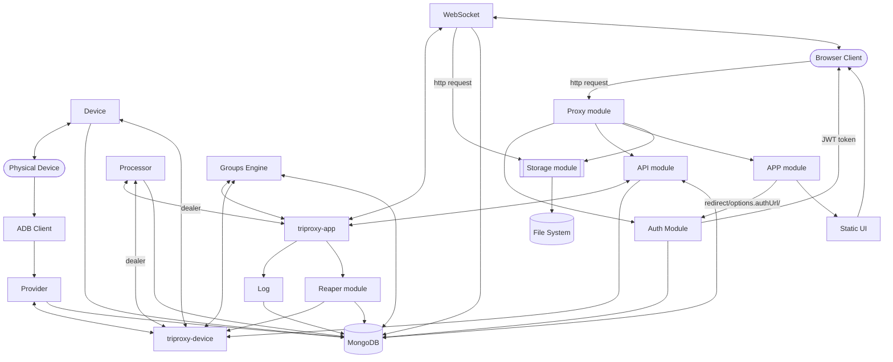

# stf-units:
* [api](#api)
* [app](#app)
* [auth](#auth)
* [device](#device)
* [groups-engine](#groups-engine)
* [log](#log)
* [prooxy](#prooxy)
* [processor](#processor)
* [provider](#provider)
* [reaper](#reaper)
* [storage](#storage)
* 
=====
* [scheme](#scheme)
## api
The **api** is a RESTful API service that provides access to the DeviceHub functionality.
This module is structured around a Swagger/OpenAPI specification that defines all available endpoints.
It allows users to interact with devices, groups, and user management through HTTP endpoints.

The API is organized into several main resource categories:
- User Operations - Endpoints for user profile management and authentication
- Devices Operations - Endpoints for device management and control
- Groups Operations - Endpoints for managing device groups
- Admin Operations - Privileged operations for administrators

==============================
## app
The **app** is a component that serves as the main application UI service.
It's responsible for handling HTTP requests and serving static resources to users.

Key Functionality:
- Serves the React frontend application
- Provides authentication redirection
- Exposes API endpoints for frontend communication
- Serves static assets and documentation

==============================
## auth
DeviceHub supports multiple authentication mechanisms:
- LDAP Authentication - Enterprise directory integration
- Mock Authentication - Simple name/email based authentication for testing
- SAML2 Authentication - Single sign-on integration
- OAuth2 Authentication - Third-party authentication providers
- OpenID Authentication - OpenID Connect authentication

Each authentication module is implemented as a separate unit that can be started independently.
These units handle user authentication and generate JWT tokens that are used for next API requests
and WebSocket connections.

==============================
## device
The **device** is a component that handles device connections, screen streaming, and device control functionality.

It's responsible for:
- Managing device connections
- Streaming device screens to the UI
- Handling user interactions with devices
- Providing device information and status

==============================
## groups-engine
The **groups-engine** is managing device groups, handling the lifecycle and relationships between users, devices, and groups.
It's responsible for:
- Managing the lifecycle of groups (creation, updates, deletion)
- Handling group membership (users and devices)
- Maintaining consistency between groups and devices
- Broadcasting group-related events to other components

  ==============================
## log
The **log** unit works by subscribing to log events from connected devices and storing them in a database

==============================
## prooxy
The **poorxy** unit is a simple HTTP reverse proxy that sits in front of all the other HTTP-based services in DeviceHub.
It routes incoming requests to the appropriate backend services based on URL paths.

==============================
## processor
The **processor** is a service that handles communication between the device side and the application side.
It routes messages between these two sides using ZeroMQ sockets and processes various types of messages defined in the wire protocol.

==============================
## provider
The **provider** module is responsible for tracking and managing physical devices connected to the system.
It's a component that discovers devices, spawns device workers, and provides communication between devices and the rest of the system.

Its main responsibilities include:
- Tracking devices connected to the ADB server
- Registering new devices with the system
- Spawning device worker processes for each device
- Managing communication between devices and the processor unit index.

How Provider Works:
When the provider unit starts, it connects to the ADB server and begins tracking devices. It sets up ZeroMQ sockets for communication with other components of the system:
A "push" socket for sending messages to the processor
A "sub" socket for receiving messages from other components index.

When a new device is detected, the provider:
1. Filters out unwanted devices (like remote devices if not allowed)
2. Sends a DeviceIntroductionMessage to the processor
3. Sets the device type in the database
4. Spawns a device worker process to manage the device.

For each device, the provider spawns a dedicated worker process that handles all device-specific operations.
The provider allocates ports for the worker and start monitoring device status.
If a worker crashes or exits unexpectedly, the provider can restart it to ensure continuous device availability.

==============================
## reaper
The **reaper** unit receives heartbeat events from device workers and tracks device status. Its main purpose is to ensure the integrity of the present/absent flag in the database, especially when a provider shuts down unexpectedly or another failure occurs.

==============================
## storage
DeviceHub has multiple **storage** unit types that handle file storage for various purposes like temporary files,
APKs, images, and S3-based storage.

DeviceHub implements several storage units that serve different purposes:

- Temporary Storage (storage-temp): Stores files temporarily in the local filesystem
- S3 Storage (storage-s3): Stores files in Amazon S3 cloud storage
- Storage Plugins:
  - APK Plugin (storage-plugin-apk): Handles Android application packages
  - Image Plugin (storage-plugin-image): Processes and resizes images

==============================
## websocket
The **websocket** is a component that provides real-time communication between the client-side JavaScript and the server-side ZeroMQ+Protobuf system.
It acts as a bridge that enables almost every action in DeviceHub to flow between the user interface and the device management system.

==============================

## scheme

