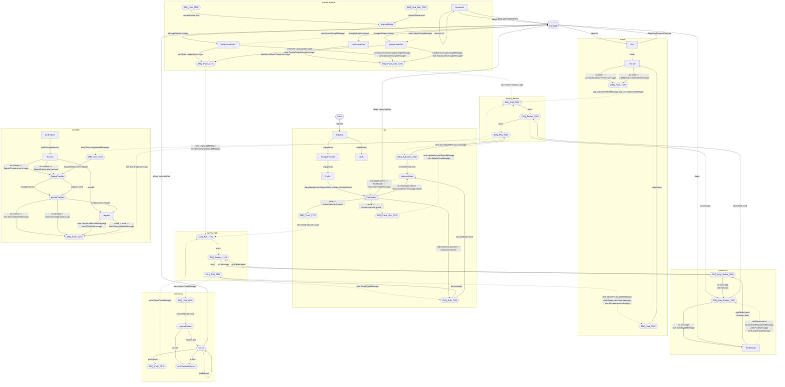

# stf
Here there are schemas of few system unit.(For convenience, comment out unnecessary units (except triproxy, client and mongodb))

```mermaid
flowchart 
mn[(mongodb)]
client([client])
%%==========triproxy==========  
    subgraph triproxy-app
        zmqPubApp{{ZMQ_Pub_7150}}
        zmqDealerApp{{ZMQ_Dealer_7160}}
        zmqPullApp{{ZMQ_Pull_7170}}
        zmqPullApp -->|proxy| zmqDealerApp
        zmqDealerApp -->|proxy| zmqPubApp
    end
    subgraph triproxy-device
        zmqPubDev{{ZMQ_Pub_7250}}
        zmqDealerDev{{ZMQ_Dealer_7260}}
        zmqPullDev{{ZMQ_Pull_7270}}
        zmqPullDev -->|proxy| zmqDealerDev
        zmqDealerDev -->|proxy| zmqPubDev
    end
    
%%==========reaper==========
zmqPubApp -..->|wire.DeviceIntroductionMessage,\nwire.DeviceHeartbeatMessage,\nwire.DeviceAbsentMessage| zmqSubRep
zmqPushRep -.->|wire.DevicePresentMessage,wire.DeviceAbsentMessage| zmqPullDev
reaper.this -->|dbapi.loadPresentDevices| mn
mn -->|devices| reaper.this
subgraph reaper
zmqSubRep{{ZMQ_Sub_7150}}
zmqPushRep{{ZMQ_Push_7270}}
ttl[TTL Set]
reaper.this[this]
reaper.this -->|bump| ttl
ttl -->|on.insert -> push/wire.DevicePresentMessage/| zmqPushRep
ttl -->|on.drop -> push/wire.DeviceAbsentMessage/| zmqPushRep
zmqSubRep -->|drop,bump| ttl
end

%%==========groups-engine==========
sched -->|timeout 1000 ms| sched
sched -->|timeout 8 h| sched
sched -->|dbapi: query/update| mn
sched -->|dbapi.generateIndexes| mn
mn -->|changeStream.change| wDev
mn -->|changeStream.change| wUs
mn -->|changeStream.change| wGr
subgraph groups-engine
    sched[Scheduler]
    wDev[devices-watcher]
    wUs[users-watcher]
    wGr[groups-watcher]
    chRGrEn{{channelRoute}}
    zmqSubGrEn{{ZMQ_Sub_7150}}
    zmqPushGrEn{{ZMQ_Push_7170}}
    zmqSubDevGrEn{{ZMQ_Sub_Dev_7250}}
    zmqPushDevGrEn{{ZMQ_Push_Dev_7270}}

    zmqSubGrEn -->|channelRoute.emit| chRGrEn
    zmqSubDevGrEn -->|channelRoute.emit| chRGrEn
    wUs -->|send/wire.UserChangeMessage/| zmqPushDevGrEn
    
    chRGrEn -.->|wire.LeaveGroupMessage| wDev
    wDev -->|send/wire.UngroupMessage/| zmqPushGrEn
    wDev -->|send/wire.DeviceGroupChangeMessage\n,wire.DeviceChangeMessage/| zmqPushDevGrEn

    chRGrEn -.->|wire.LeaveGroupMessage| wGr
    wGr -->|send/wire.UngroupMessage,\nwire.DeviceOriginGroupMessage/| zmqPushGrEn
    wGr -->|send/wire.GroupChangeMessage,\nwire.GroupUserChangeMessage/| zmqPushDevGrEn

    zmqPushGrEn -.->|wire.UngroupMessage,\nwire.DeviceOriginGroupMessage| zmqPullApp
    zmqPushDevGrEn -.->|wire.SomeTypeMessage| zmqPullDev
end

%%==========api==========
zmqPushApi -.->|wire.SomeTypeMessage| zmqPullApp
zmqPushDevApi -.->|wire.UpdateAccessTokenMessage\n wire.DeleteUserMessage| zmqPullDev
zmqPubApp -.->|wire.SomeTypeMessage| zmqSubApi
zmqSubApi -->|on.message| zmqPubApp
zmqPubDev -.->|wire.SomeTypeMessage| zmqSubDevApi
zmqSubDevApi -->|on.message| zmqPubDev
client -->|request| exp
cntrls -->|dbapi: query/update| mn
subgraph api
    chRApi{{channelRoute}}
    zmqSubApi{{ZMQ_Sub_7150}}
    zmqPushApi{{ZMQ_Push_7170}}
    zmqSubDevApi{{ZMQ_Sub_Dev_7250}}
    zmqPushDevApi{{ZMQ_Push_Dev_7270}}
    auth[Auth]
    exp[Express]
    swg[Swagger/Router]
    paths[Paths]
    cntrls[[Controllers]]
    
    exp -->|middleware| auth
    exp -->|req.options| swg
    swg -->|req.options| paths
    paths -->|req.options/push,sub,pushDev,subDev,channelRoute/| cntrls
    cntrls -->|send -> chanel:device.channel| zmqPushApi
    cntrls -->|send -> chanel:req.user.group| zmqPushDevApi
    cntrls -->|subscribe/unsubscribe -> responseChannel| zmqSubApi
    zmqSubApi -->|channelRoute.emit| chRApi
    zmqSubDevApi -->|channelRoute.emit| chRApi
    cntrls -->|on.messageListener, removeListener.messageListener| chRApi
    chRApi -.->|messageListener -> WireRouter -> wire.SomeTypeMessage| cntrls
end

%%==========processor==========
zmqDealerDev -->|on.message| zmqDevDealerProc
zmqDevDealerProc -->|devDealer.send| zmqDealerDev
zmqDealerApp -->|on.message| zmqAppDealerProc
zmqAppDealerProc -->|appDealer.send| zmqDealerApp
procWireRoute -->|dbapi| mn
subgraph processor
    zmqAppDealerProc{{ZMQ_App_Dealer_7160}}
    zmqDevDealerProc{{ZMQ_Dev_Dealer_7260}}
    procWireRoute[WireRouter]
    zmqAppDealerProc -->|on.message\nchannel,data| zmqDevDealerProc
    zmqDevDealerProc -->|on.message\nwire.SomeTypeMessage| procWireRoute
    procWireRoute -->|appDealer.send\nchannel, data| zmqAppDealerProc
    procWireRoute -..->|devDealer.send\nwire.DeviceRegisteredMessage\nwire.ProbeMessage\nwire.AutoGroupMessage| zmqDevDealerProc
end

%%==========provider==========
    zmqPubDev -.->|wire.DeviceRegisteredMessage| zmqSubPr
    zmqPushPr -.->|wire.SomeTypeMessage| zmqPullDev
    subgraph provider
        direction LR
        adb[ADB Client]
        tr[Tracker]
        flTr{{flippedTracker}}
        zmqSubPr{{ZMQ_Sub_7250}}
        zmqPushPr{{ZMQ_Push_7270}}
        prTr{{privateTracker}}
        rg[register]
        adb -->|add/change/remove| tr
        tr -->|on.change -> flippedTracker.emit-change| flTr
        tr -->|on.remove -> flippedTracker.emit-remove| flTr
        tr -->|on.add| rg
        flTr -->|change/remove| prTr
        flTr -->|register_once| prTr
        zmqSubPr -->|flippedTracker.emit-register| flTr
        prTr -->|on.remove -> wire.DeviceAbsentMessage| zmqPushPr
        prTr -->|on.change -> wire.DeviceStatusMessage| zmqPushPr
        prTr -->|on.remove/on.change| rg
        rg -->|wire.DeviceIntroductionMessage\nwire.ProviderMessage| zmqPushPr
        rg -->|check -> work -> wire.DeviceAbsentMessage| zmqPushPr
    end
    
%%==========websocket==========
    zmqPubApp -.->|wire.SomeTypeMessage| zmqSub01
    zmqPush01 -.->|wire.SomeTypeMessage| zmqPullApp
    zmqSub01 -->|channelRouter.emit| chR
    sc -->|dbapi.someMethod| mn
    sc -->|push.send| zmqPush01
    subgraph websocket
        chR{{channelRouter}}
        wss{{io-WebsocketServer}}
        sc{{socket}}
        zmqSub01{{ZMQ_Sub_7150}}
        zmqPush01{{ZMQ_Push_7170}}
        chR -->|socket.emit| sc
        chR -->|io.emit| wss
        sc -->|io.emit| wss
        sc -->|socket.emit| sc
    end
```

